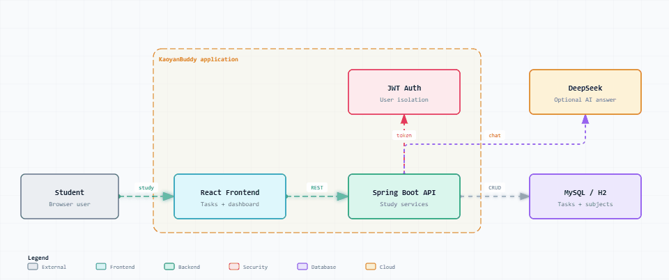

# KaoyanBuddy — 考研规划助手

> **AI 智能答疑 · 任务流管理 · 数据看板**

KaoyanBuddy 是一个考研规划助手，提供 AI 智能答疑、学习任务管理、科目管理和数据看板能力，目标是把备考过程拆成可跟踪、可复盘的日常任务流。

---

## ✨ 核心特性

- 🤖 **AI 智能答疑**：未配置 DeepSeek Key 时返回本地 fallback 答复。
- ✅ **任务跟踪**：每日学习任务生成与完成状态跟踪。
- 📊 **数据看板**：学习时长、完成率和科目进度可视化。
- 📚 **科目管理**：科目分类管理。
- 🔐 **登录与隔离**：JWT 登录注册与用户数据隔离。

---

## 🚀 快速开始

### 1. 前端

```bash
cd frontend
npm install
npm run dev
```

前端默认地址为 `http://localhost:5173`。

`frontend/.env.example` 默认是 Mock 演示模式；当前本机联调可在 `frontend/.env` 中设置：

```text
VITE_API_BASE_URL=http://localhost:8080/api
VITE_USE_MOCK=false
```

### 2. 后端 MySQL 模式

```bash
cd backend
mvn spring-boot:run
```

后端默认地址为 `http://localhost:8080`，健康检查接口为 `GET http://localhost:8080/api/health`。

本地默认 MySQL 配置：

```text
DB_URL=jdbc:mysql://localhost:3306/kaoyan_buddy?useUnicode=true&characterEncoding=utf8&serverTimezone=Asia/Shanghai&createDatabaseIfNotExist=true
DB_USERNAME=root
DB_PASSWORD=123456
```

正式环境请使用环境变量覆盖默认密码和 JWT Secret。

### 3. 后端 H2 开发模式

如果不想连接 MySQL，可以使用 H2 本地开发库启动：

```bash
cd backend
mvn spring-boot:run -Dspring-boot.run.profiles=dev
```

H2 开发库文件保存在 `backend/data/`，不会提交到 Git。

### 4. DeepSeek 配置

默认 `SPRING_AI_MODEL_CHAT=none`，因此不需要 DeepSeek Key 也能启动。`POST /api/ai/chat` 会返回：

```json
{ "answer": "本地降级建议", "fallback": true }
```

需要真实 AI 答复时，设置：

```text
SPRING_AI_MODEL_CHAT=deepseek
DEEPSEEK_API_KEY=你的 Key
```

---

## 📂 项目结构

```text
KaoyanBuddy/
├── backend/               # Spring Boot 后端（Maven 工程）
│   ├── src/               # Java 源码
│   └── data/              # H2 开发库文件（不提交 Git）
├── frontend/              # React 前端（Vite + Tailwind）
│   └── src/               # pages / components / api / context / utils
├── docs/                  # 开发文档与架构图
├── logs/                  # 前后端本地运行日志
└── README.md
```

详细开发计划见 [docs/frontend-first-plan.md](docs/frontend-first-plan.md)。

---

## 🛠️ 技术栈

- **前端**：React + Vite + Tailwind CSS
- **后端**：Spring Boot（Maven），支持 MySQL 与 H2 双数据源模式
- **AI**：Spring AI 接入 DeepSeek，未配置 Key 时本地 fallback
- **认证**：JWT 登录注册与用户数据隔离

---

## ⚠️ 当前状态与注意事项

**当前验证状态：**

- 前端 `npm run build` 已通过。
- 后端 `mvn test` 已通过，覆盖注册登录、鉴权、用户隔离、任务状态、看板统计和 AI fallback。
- 后端默认 MySQL profile 已在本机 `root / 123456` 下启动成功。
- 前端 `VITE_USE_MOCK=false` 真实 API 模式已启动成功。
- 真实 API 已联调注册、当前用户、科目、任务完成、看板统计和 AI fallback 流程。

**注意事项：**

依赖安装、构建、测试和 MySQL 建库建表可能写入本机缓存或数据库目录。任何会减少 C 盘容量的操作，执行前都需要先确认预计增量。

---

## 🖼️ 动态系统架构图



- [打开交互式动态架构图](docs/architecture/dynamic-archify-architecture.html)
- [查看架构源数据](docs/architecture/dynamic-archify-architecture.json)
